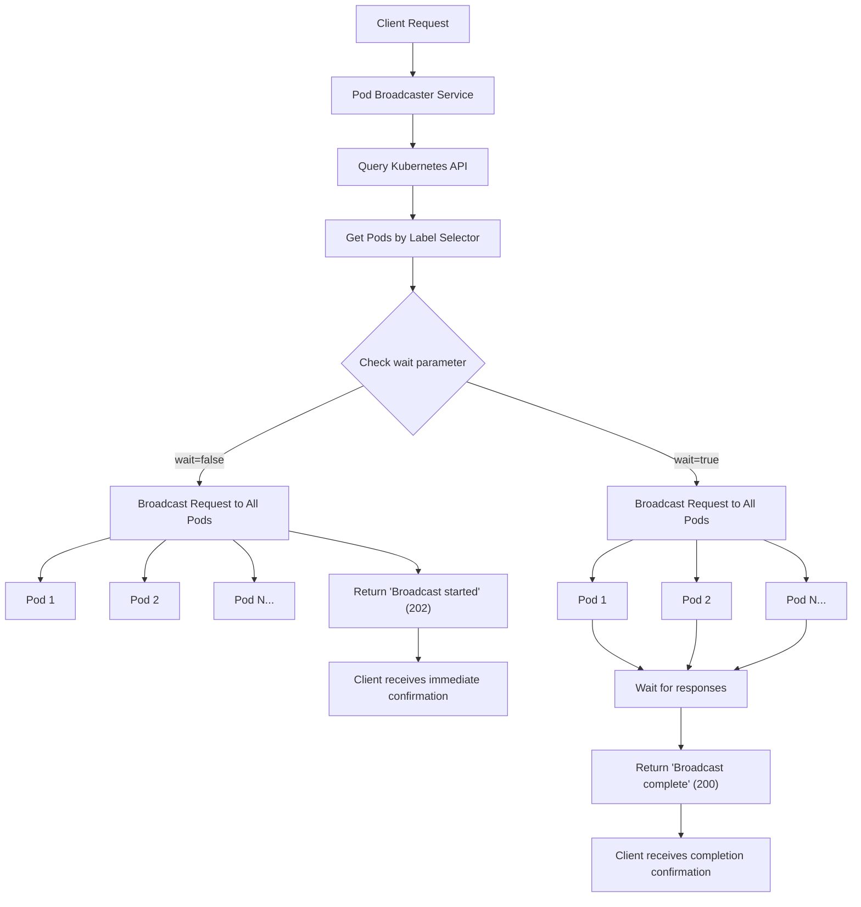

<div align="center">

# <br>Kubernetes Pod Broadcaster

[](https://github.com/ministryofjustice/kubernetes-pod-broadcaster/actions/workflows/snyk.yml)
[](https://github.com/ministryofjustice/kubernetes-pod-broadcaster/actions/workflows/test.yml)
<br>
[![Standards Icon]][Standards Link]
[![License Icon]][License Link]

<hr>

#### A lightweight server that listens for requests and broadcasts them to a group of pods.

The initial use case for this is to propagate cache clearing requests to all pods within a namespace.
This way, an application can make a single request to clear nginx's cache, which may exist across multiple pods.

</div>

## How it works

A high level overview of how this works is shown below:



For further understanding, refer to [main.ts](./main.ts).

To read the functions in a logical order:

1. serverHandler - handles incoming requests.
1. fetchPods - fetches pods from the Kubernetes API.
1. broadcastRequest - broadcasts the request to the pods.

**Used by:**

- [intranet.justice.gov.uk](https://intranet.justice.gov.uk/)
- [www.justice.gov.uk](https://www.justice.gov.uk/) (TBC)

## Local development

To run the application locally:

`docker build -t app . && docker run -it -p 1993:1993 -e TOKEN=fake-token app`

To make changes to the application locally:

`docker build -t app . && docker run -it -p 1993:1993 -v .:/app --entrypoint=/bin/ash app`

From the container's terminal, you can now run Deno commands:

`deno test --watch`

`deno dev --watch`

### Environment labels

The following environment variables can be set to configure the application:

| Variable          | Description                                                  | Default         |
| ----------------- | ------------------------------------------------------------ | --------------- |
| PORT              | The port the application will listen on.                     | 1993            |
| TOKEN             | The bearer token used to authenticate requests.              | (none)          |
| NAMESPACE         | The Kubernetes namespace to query for pods.                  | default         |
| LABEL_SELECTOR    | The label selector to filter pods.                           | app=web         |
| CACHE_DURATION_MS | The duration to cache the list of pods for, in milliseconds. | 1000 (1 second) |
| DEBUG             | Enable debug logging.                                        | false           |
| ALLOWED_HEADERS   | Comma-separated list of headers to forward to pods.          | (none)          |

### Request parameters

The following query parameters can be included in the request to modify its behaviour:

| Parameter | Description                                                                              | Default                                                        |
| --------- | ---------------------------------------------------------------------------------------- | -------------------------------------------------------------- |
| \_wait    | If `true`, the server will wait for all pods to respond before responding with a 200 OK. | "false" - the server responds immediately with a 202 Accepted. |
| \_port    | The port on the target pods.                                                             | 8080                                                           |

### Request headers

By default, the `host` header is forwarded to the target pods. To forward other specific headers, set the `ALLOWED_HEADERS` environment variable to a comma-separated list of header names.
For example, to forward the `Authorization` and `X-Custom-Header` headers, set:

```bash 
ALLOWED_HEADERS="Authorization,X-Custom-Header"
```

### Using this in a cluster

First, build the image and push it to a registry.

```bash
docker build -t <your-registry>/kubernetes-pod-broadcaster:latest .
docker push <your-registry>/kubernetes-pod-broadcaster:latest
```

Then, create a deployment and service in your cluster. An example manifest is provided in the `examples` directory.

You will need to create a service account, role, and role binding to allow the application to query the Kubernetes API for pods. Example manifests are provided in the `examples` directory. On the MoJ Cloud Platform, these are created with the service account terraform module.

Finally create a service to expose the deployment. An example manifest is provided in the `examples` directory.

You should now be able to access the application within your cluster on port `1993`.

A single request to `http://pod-broadcaster-service.namespace.svc.cluster.local:1993/broadcast/<your-path>` will be broadcast to pods as specified by the label selector.

## Security first

This repository uses Snyk to monitor vulnerabilities that occur in a Docker image. Snyk runs on an automated schedule ensuring we get the latest patched updates regularly.

To modify the schedule you can edit the GitHub Action located in `.github/workflows`.

<!-- License -->

[License Link]: https://github.com/ministryofjustice/kubernetes-pod-broadcaster/blob/main/LICENSE "License."
[License Icon]: https://img.shields.io/github/license/ministryofjustice/kubernetes-pod-broadcaster?style=for-the-badge

<!-- MoJ Standards -->

[Standards Link]: https://operations-engineering-reports.cloud-platform.service.justice.gov.uk/public-report/kubernetes-pod-broadcaster "Repo standards badge."
[Standards Icon]: https://img.shields.io/endpoint?labelColor=231f20&color=005ea5&style=for-the-badge&url=https%3A%2F%2Foperations-engineering-reports.cloud-platform.service.justice.gov.uk%2Fapi%2Fv1%2Fcompliant_public_repositories%2Fendpoint%2Fkubernetes-pod-broadcaster&logo=data:image/png;base64,iVBORw0KGgoAAAANSUhEUgAAACgAAAAoCAYAAACM/rhtAAAABmJLR0QA/wD/AP+gvaeTAAAHJElEQVRYhe2YeYyW1RWHnzuMCzCIglBQlhSV2gICKlHiUhVBEAsxGqmVxCUUIV1i61YxadEoal1SWttUaKJNWrQUsRRc6tLGNlCXWGyoUkCJ4uCCSCOiwlTm6R/nfPjyMeDY8lfjSSZz3/fee87vnnPu75z3g8/kM2mfqMPVH6mf35t6G/ZgcJ/836Gdug4FjgO67UFn70+FDmjcw9xZaiegWX29lLLmE3QV4Glg8x7WbFfHlFIebS/ANj2oDgX+CXwA9AMubmPNvuqX1SnqKGAT0BFoVE9UL1RH7nSCUjYAL6rntBdg2Q3AgcAo4HDgXeBAoC+wrZQyWS3AWcDSUsomtSswEtgXaAGWlVI2q32BI0spj9XpPww4EVic88vaC7iq5Hz1BvVf6v3qe+rb6ji1p3pWrmtQG9VD1Jn5br+Knmm70T9MfUh9JaPQZu7uLsR9gEsJb3QF9gOagO7AuUTom1LpCcAkoCcwQj0VmJregzaipA4GphNe7w/MBearB7QLYCmlGdiWSm4CfplTHwBDgPHAFmB+Ah8N9AE6EGkxHLhaHU2kRhXc+cByYCqROs05NQq4oR7Lnm5xE9AL+GYC2gZ0Jmjk8VLKO+pE4HvAyYRnOwOH5N7NhMd/WKf3beApYBWwAdgHuCLn+tatbRtgJv1awhtd838LEeq30/A7wN+AwcBt+bwpD9AdOAkYVkpZXtVdSnlc7QI8BlwOXFmZ3oXkdxfidwmPrQXeA+4GuuT08QSdALxC3OYNhBe/TtzON4EziZBXD36o+q082BxgQuqvyYL6wtBY2TyEyJ2DgAXAzcC1+Xxw3RlGqiuJ6vE6QS9VGZ/7H02DDwAvELTyMDAxbfQBvggMAAYR9LR9J2cluH7AmnzuBowFFhLJ/wi7yiJgGXBLPq8A7idy9kPgvAQPcC9wERHSVcDtCfYj4E7gr8BRqWMjcXmeB+4tpbyG2kG9Sl2tPqF2Uick8B+7szyfvDhR3Z7vvq/2yqpynnqNeoY6v7LvevUU9QN1fZ3OTeppWZmeyzRoVu+rhbaHOledmoQ7LRd3SzBVeUo9Wf1DPs9X90/jX8m/e9Rn1Mnqi7nuXXW5+rK6oU7n64mjszovxyvVh9WeDcTVnl5KmQNcCMwvpbQA1xE8VZXhwDXAz4FWIkfnAlcBAwl6+SjD2wTcmPtagZnAEuA3dTp7qyNKKe8DW9UeBCeuBsbsWKVOUPvn+MRKCLeq16lXqLPVFvXb6r25dlaGdUx6cITaJ8fnpo5WI4Wuzcjcqn5Y8eI/1F+n3XvUA1N3v4ZamIEtpZRX1Y6Z/DUK2g84GrgHuDqTehpBCYend94jbnJ34DDgNGArQT9bict3Y3p1ZCnlSoLQb0sbgwjCXpY2blc7llLW1UAMI3o5CD4bmuOlwHaC6xakgZ4Z+ibgSxnOgcAI4uavI27jEII7909dL5VSrimlPKgeQ6TJCZVQjwaOLaW8BfyWbPEa1SaiTH1VfSENd85NDxHt1plA71LKRvX4BDaAKFlTgLeALtliDUqPrSV6SQCBlypgFlbmIIrCDcAl6nPAawmYhlLKFuB6IrkXAadUNj6TXlhDcCNEB/Jn4FcE0f4UWEl0NyWNvZxGTs89z6ZnatIIrCdqcCtRJmcCPwCeSN3N1Iu6T4VaFhm9n+riypouBnepLsk9p6p35fzwvDSX5eVQvaDOzjnqzTl+1KC53+XzLINHd65O6lD1DnWbepPBhQ3q2jQyW+2oDkkAtdt5udpb7W+Q/OFGA7ol1zxu1tc8zNHqXercfDfQIOZm9fR815Cpt5PnVqsr1F51wI9QnzU63xZ1o/rdPPmt6enV6sXqHPVqdXOCe1rtrg5W7zNI+m712Ir+cer4POiqfHeJSVe1Raemwnm7xD3mD1E/Z3wIjcsTdlZnqO8bFeNB9c30zgVG2euYa69QJ+9G90lG+99bfdIoo5PU4w362xHePxl1slMab6tV72KUxDvzlAMT8G0ZohXq39VX1bNzzxij9K1Qb9lhdGe931B/kR6/zCwY9YvuytCsMlj+gbr5SemhqkyuzE8xau4MP865JvWNuj0b1YuqDkgvH2GkURfakly01Cg7Cw0+qyXxkjojq9Lw+vT2AUY+DlF/otYq1Ixc35re2V7R8aTRg2KUv7+ou3x/14PsUBn3NG51S0XpG0Z9PcOPKWSS0SKNUo9Rv2Mmt/G5WpPF6pHGra7Jv410OVsdaz217AbkAPX3ubkm240belCuudT4Rp5p/DyC2lf9mfq1iq5eFe8/lu+K0YrVp0uret4nAkwlB6vzjI/1PxrlrTp/oNHbzTJI92T1qAT+BfW49MhMg6JUp7ehY5a6Tl2jjmVvitF9fxo5Yq8CaAfAkzLMnySt6uz/1k6bPx59CpCNxGfoSKA30IPoH7cQXdArwCOllFX/i53P5P9a/gNkKpsCMFRuFAAAAABJRU5ErkJggg==
